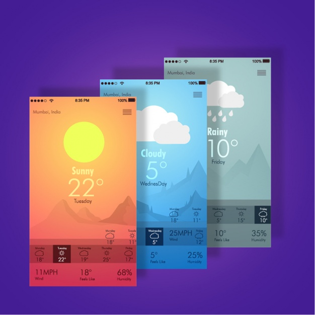
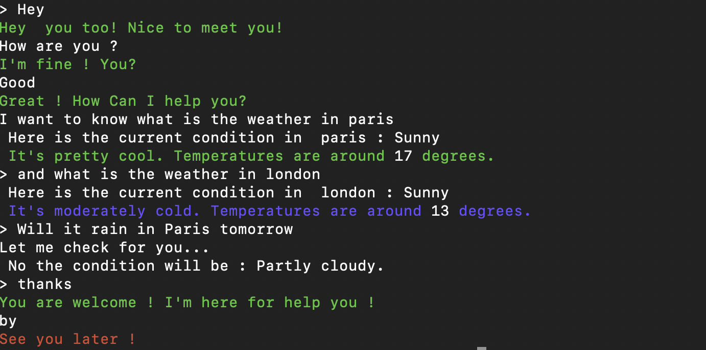

## Weather-Chatbot




### Get the current weather anywhere in the world.


## Run the weather bot

- Clone this repository : `https://github.com/Nath19/Weather-Chatbot.git`

```sh
❯ cd /path/to/workspace
❯ git clone git@github.com:Nath19/Weather-Chatbot.git
```
- Install dependencies :

```
❯ npm i
```

- Launch the app :

```
❯ nodemon app.js
```

## Demo




## Licence

[Uncopyrighted](http://zenhabits.net/uncopyright/)
